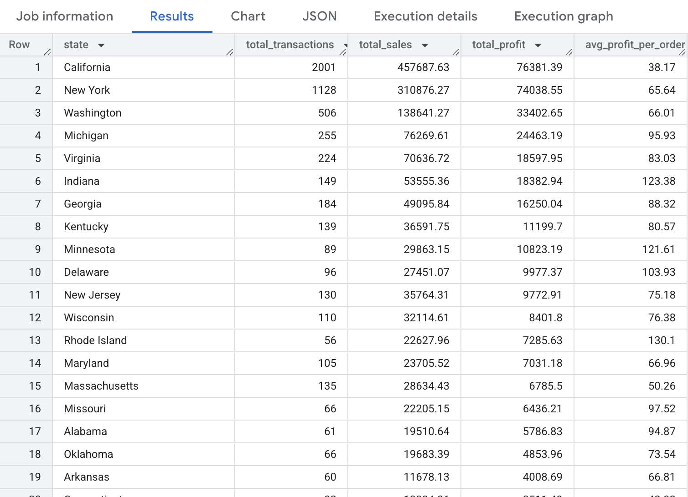

# 🏬 Sample Superstore Sales Analysis

This project explores the "Sample Superstore" dataset to uncover trends in sales, profit, shipping, and regional performance across the United States. The goal is to identify business insights that can drive better decision-making in areas like product strategy, regional investment, and customer targeting.

---

-- Readme File contains SQL based analysis
-- SuperStoreAnalysis.ipynb file contains Python based analysis

---

# SQL

### 🔍 Key Questions Explored:

- 💰 Which customer segments generate the most revenue and profit?
- 🌍 Which regions are performing the best and worst?
- 📉 How do different discount levels impact profitability?
- 🧾 What is the overall performance of the business?
- 📦 Which pricing/discount strategies are most profitable?
- 🧑‍💼 How does customer type affect profitability strategy?
- 📊 Which parts of the business need attention to improve profit margins?

### 🧰 Tools & Technologies:

- Python
- Jupyter Notebook
- PowerBI
- BigQuery
- Data cleaning and exploratory data analysis (EDA)

The insights from this analysis can support strategic planning in retail, especially for optimizing logistics and maximizing profit margins.

## 📊 Executive Summary - Business KPIs

This query calculates key metrics from the Sample Superstore dataset to provide a quick overview of business performance:

<pre> ```
SELECT State as state,
       COUNT(\*) AS total_transactions,
       ROUND(SUM(Sales), 2) AS total_sales,
       ROUND(SUM(Profit), 2) AS total_profit,
       ROUND(AVG(Profit), 2) AS avg_profit_per_order
  FROM SuperStoreDataset.store_data
 group by state
 order by ROUND(SUM(Profit), 2) desc
``` </pre>



- **Total Customers**: Number of unique customers
- **Total Transactions**: Total sales entries
- **Total Sales**: Total revenue across all sales
- **Total Profit**: Combined profit
- **Average Profit per Transaction**: Average profitability per sale

---

---

## 🔑 Overall Performance KPIs

This executive snapshot highlights key KPIs derived from SQL analysis of the Sample Superstore dataset. It reveals patterns in sales, profitability, discount strategy, and customer segments to support smarter business decisions.

<pre>```
SELECT
  ROUND(SUM(Sales),) AS Total_Sales,
  ROUND(SUM(Profit),) AS Total_Profit,
  ROUND(AVG(Discount) * 100, 2) AS Avg_Discount_Percent
FROM SuperStoreDataset.store_data
```</pre>

---

### 🔑 Overall Performance KPIs

| Metric              | Value          |
| ------------------- | -------------- |
| 💵 **Total Sales**  | \$2,297,200.86 |
| 📈 **Total Profit** | \$286,397.02   |
| 🏷️ **Avg Discount** | 15.62%         |
| 🧾 **Orders**       | ~10,000        |

> 💡 **Profit Margin:** ~12.5% — healthy, but discounting is significantly eroding profitability.

---

### 🧠 Key Insights

- **High Discounts = Low Profit**: The average discount is **15.62%**, but profits are not scaling with sales.
- **Sales are strong**, but much of the margin is lost on overly discounted orders.
- Certain **product categories** (like _Tables_) are consistently unprofitable.
- The **Corporate** and **Home Office** segments show better profit per order than Consumer.

---

### ✅ Recommended Actions

- 🧮 Recalibrate discount strategy — aim for **≤10%** average.
- 🚫 Reduce or replace products with **chronic negative profit**.
- 📦 Prioritize **Technology** and **Office Supplies** in growth strategies.
- 🧑‍💼 Expand targeting toward **Corporate** and **Home Office** segments.

---

---

### 🌍 Regional Performance – Sales & Profit by Region

<pre>
```SELECT 
  Region,
  ROUND(SUM(Sales), 2) AS Sales,
  ROUND(SUM(Profit), 2) AS Profit
FROM SuperStoreDataset.store_data
GROUP BY Region
ORDER BY Profit DESC;```
</pre>

| Region  | 💵 Total Sales | 📈 Total Profit |
| ------- | -------------- | --------------- |
| West    | \$725,457.82   | \$108,418.45    |
| East    | \$678,781.24   | \$91,522.78     |
| South   | \$391,721.90   | \$46,749.43     |
| Central | \$501,239.89   | \$39,706.36     |

---

#### 🔎 Key Insights:

- **West** is the strongest region, leading in both sales and profit.
- **East** follows closely behind, showing balanced revenue and profitability.
- **South** has healthy revenue but a significantly lower profit margin — **possible cost or discount inefficiency**.
- **Central** has the **lowest profit** despite moderate sales, indicating room for margin improvement.

> ✅ **Actionable Step**: Conduct a cost analysis and discount review for South and Central regions to boost profitability.

---

---

### 🏷️ Discount Impact on Profitability

<pre>```sql
SELECT 
  CASE 
    WHEN Discount = 0 THEN 'No Discount'
    WHEN Discount BETWEEN 0.01 AND 0.2 THEN 'Low (0-20%)'
    WHEN Discount > 0.2 THEN 'High (>20%)'
  END AS Discount_Level,
  ROUND(SUM(Profit), 2) AS Total_Profit
FROM SuperStoreDataset.store_data
GROUP BY Discount_Level
ORDER BY Total_Profit DESC;
```</pre>

| Discount Level | 📈 Total Profit   |
| -------------- | ----------------- |
| No Discount    | \$320,987.60      |
| Low (0–20%)    | \$100,785.47      |
| High (>20%)    | **–\$135,376.06** |

---

#### 🔎 Key Insights:

- ✅ **No Discount** sales deliver the **highest profit**, making up the majority of overall profitability.
- 🟡 **Low discounts (0–20%)** remain profitable but are significantly less efficient than no-discount sales.
- ❌ **High discounts (>20%) lead to losses** — over **\$135K in negative profit**, a major red flag for margin sustainability.

---

#### ✅ Recommended Actions:

- 🔒 **Limit deep discounts** — only use >20% in rare, strategic cases.

---

---

### 🧑‍💼 Sales & Profit by Customer Segment

| Segment     | 💵 Total Sales | 📈 Total Profit |
| ----------- | -------------- | --------------- |
| Consumer    | \$1,161,401.34 | \$134,119.21    |
| Corporate   | \$706,146.37   | \$91,979.13     |
| Home Office | \$429,653.15   | \$60,298.68     |

<pre>
```SELECT 
  Segment,
  ROUND(SUM(Sales), 2) AS Sales,
  ROUND(SUM(Profit), 2) AS Profit
FROM SuperStoreDataset.store_data
GROUP BY Segment
ORDER BY Profit DESC;
```
</pre>

---

#### 🔍 Key Insights:

- 🥇 **Consumer segment** generates the highest revenue and profit, making it the **core driver of the business**.
- 🏢 **Corporate clients** are the second most valuable group, with **strong profitability relative to their sales volume**.
- 🏠 **Home Office** is the smallest segment, yet still contributes meaningfully to total profit.

---

#### ✅ Recommended Strategy:

- 🔁 Continue to **nurture and expand the Consumer base**, especially in profitable product categories.
- 🎯 **Upsell to Corporate clients**, who show high profit-to-sales efficiency.
- 📢 Develop marketing strategies to grow the **Home Office segment** — potential for scaling with lower effort.
